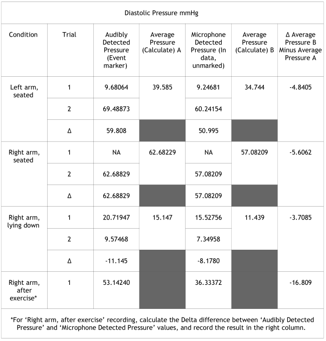
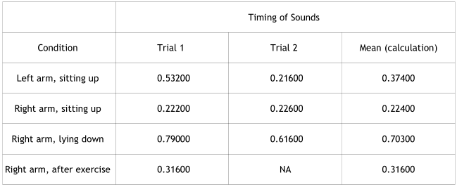

L16 - Blood Pressure (4.1.2 Jan 11 2017)

File name: DaveL16-L16

05/03/2019

12:45

First recording (starts at event labeled 'Left arm, seated 1'): Cuff on left
arm, seated and relaxed.

Second recording (starts at event labeled 'Left arm, seated 2'): Cuff on left
arm, seated and relaxed.

Third recording (starts at event labeled 'Right arm, seated 1'): Cuff on right
arm, seated and relaxed.

Fourth recording (starts at event labeled 'Right arm, seated 2'): Cuff on right
arm, seated and relaxed.

Fifth recording (starts at event labeled 'Right arm, supine 1'): Cuff on right
arm, supine and relaxed.

Sixth recording (starts at event labeled 'Right arm, supine 2'): Cuff on right
arm, supine and relaxed.

Seventh recording (starts at event labeled 'Right arm, after exercise'): Cuff on
right arm, recovering from mild exercise.

----------------------------------------------------------------------------------------------------------------------------------------------------------------------------------------
# L16 DATA REPORT

Student’s Name: Michael Lenehan

Lab Section: 16

Date: 05/03/2019

# I. Data and Calculations

Subject Profile

Name: \quad Height: \quad Age:
Time: \quad Gender: \quad Weight:

Note: This Data Report assumes that all lesson recordings were performed, which
may not be the case for your lab. Please disregard any references to excluded
recordings. 

## A. Systolic Measurements

Complete Table 16.2 with the systolic measurements for all data recordings.
Note the pressure measurement at the event marker insertion point (where
Director audibly detected and marked systolic) and where the first Korotkoff
sound was detected with the stethoscope microphone. Calculate the Delta
difference between the trials for each condition, the trial average
pressure, and the Delta difference between the event marker and stethoscope
microphone average pressure measurements.

## B. Diastolic Measurements

Complete Table 16.3 with the Diastolic measurements for all data recordings.
Note the pressure measurement at the event marker insertion point (where
Director audibly detected and marked diastolic) and where the Korotkoff sound
disappeared from the stethoscope microphone. Calculate the Delta difference
between the trials for each condition, the trial average pressure, and the
Delta difference between the event marker and stethoscope microphone average
pressure measurements.

## C. BPM Measurements

Complete Table 16.4 with the BPM measurements from three cycles of each of the
seven data recordings and calculate the mean BPM for each recording.
* Cycle measurements: If ECG was recorded, use  ; if ECG was not recorded, use  .

## D. Summary of Mean Blood Pressure Data

Complete Table 16.5 with the average from sound data from tables 16.2 and 16.3
and then calculate the pulse pressure and the mean Arterial Pressure (MAP).

Note the pressure measurements at the event marker insertion points (where
Director audibly detected and marked systolic and diastolic).

$Pulse\ pressure = Systolic\ Pressures - Diastolic\ Pressure$

$MAP = \frac{pulse\ pressure}{3} + diastolic\ pressure$

OR

$MAP = \frac{(systolic\ pressure + 2(diastolic\ pressure))}{3}$

## E. Timing of Korotkoff Sounds

NOTE—This table requires ECG data, which is not recorded on MP45 systems.

Complete Table 16.6 with the Delta T for each condition, and calculate the means.

## F. Calculation of Pulse Speed

Complete the calculation in Table 16.7 using "Right arm, seated" data.

# II. Questions:

## 1. Note the difference in systolic pressure value between when the sound actually began, was detected by the stethoscope transducer, and was recorded, and the time when the observer first heard the sound and pressed the event marker keystroke. (Example: 141 mmHg – 135 mmHg = 6 mmHg). What factors could account for this difference? Would the observed difference be the same if measured by another observer? Explain your answer.

## 2.

**a) Does your systolic and/or diastolic arterial pressure change as your heart rate increases?**

Systolic arterial pressure increases with an increased heart rate, as seen in
table 16.2 above.

Diastolic pressure decreases with an increased heart rate, as seen in table 16.3
above, however there should be a small increase, or no change observed.

**(b) How does this change affect your pulse pressure?**

As pulse pressure is systolic pressure minus diastolic pressure, this gives ans
increase in pulse pressure with an increase in heart rate.

**(c) How would you expect the systolic, diastolic and pulse pressures to change
in a normal healthy individual as their heart rate increases?**

## 3. Give three sources of error in the indirect method of determining systemic arterial blood pressure.

## 4. Use an equation that relates flow, pressure, and resistance to define mean arterial pressure:

## 5. Blood flow (liters per min.) through the pulmonary circuit equals blood flow through the systemic circuit, but pulmonary resistance to flow is 5 times less than the systemic resistance to flow. Using the equation in Question 4, show that mean pulmonary pressure is 5 times less than mean systemic pressure.

## 6. Define the first and second sounds of Korotkoff. Which sound is used to approximate systolic pressure and which sound is used to approximate diastolic pressure?

## 7. Why is mean arterial pressure not equal to (systolic pressure – diastolic pressure)/2?

## 8. Define pulse pressure. Explain, in terms of changes in systolic and diastolic pressures, why pulse pressure increases during exercise.

## 9. Give one reason why blood pressure in the left armmay  be different than blood pressure in the right arm of a Subject at rest.

## 10. Name an artery other than the brachial that could be used for an indirect measurement of blood pressure and explain your choice.

End of Lesson 16 Data Report

BSL 4.1 DRL16-04092015
