# Sources of Biopotentials - The Heart and Nervous System

## Cardiovascular System (Electrocardiogram)

- Heart consists of two pumps in series
 - Smaller right-hand pump forces blood through lungs
 - Larger more powerful left-hand pump force blood through rest of body

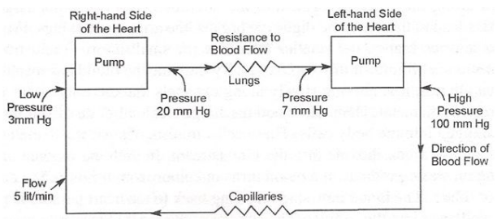

- Blood flows from heart to aorta
 - Large arteries to head, digestive organs, limbs
- Arteries branch to smaller arterioles
- Arterioles to tiny capillaries $(10\mu m)$
 - discharges load of dissolved food, oxygen into body cells
- Cells deposit waste materials (eg CO2) into bloodstream
 - Blood turns from bright red to dull red/blue
- Blood flows back to heart
 - From capillaries to venules
 - Venules to larger veins
 - End in Vena Cava, delivers to right atrium
- From here pumped to right ventricle
 - Ventricle to tricuspid valve
 - Out through pulmonary artery, opening pulmonary valve to lungs
- After oxygenation
 - Blood passes from lungs to left atrium
 - Pumped to left ventricle
 - Through mitral/bicuspid valve
 - Passes out via aorta
 - Opens aortic valve to restart circulation process
- As part of systemic circulation
 - Waste in blood removed by kidneys, liver
- Avg male blood capactiy of 5l completely circulated once a minute
- Pericardium
 - Covering of heart
 - Consists of two layers of fibrous tissue separated by small space filled with
   thin film of pericardial fluid
- Left, right sides of heart separated by septum - dividing wall of tissue
- Walls of heart made entirely of muscle surrounding four hollow chambers

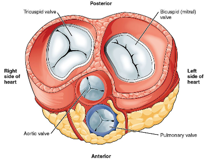

- Heart contracts 70 times per minute to squeeze blood around circulatory system
- Diastole
 - Period between contractions
 - Heart assumes max. size, fills with O2 blood from lungs, venous blood
   returning to body
- Systole
 - Contraction
 - Initiated by contraction of muscles surrounding atria which propel additional
   blood into ventricles
- Ventricles begin to contract causing rise in pressure
 - Shuts artrioventricular valves (tri/bicuspid)
 - With further contraction pressure continues to rise
- Ventricular ejection
 - Begins when pressures of systemic, pulmonary circulation exceeded
 - Aortic valve forced open
 - Blood squeezed into aorta, onward to systemic circulation
- Peak pressure of blood flow 120 mm Hg
 - Systolic Pressure
- Min. pressure of blood flow 80 mm Hg
 - Diastolic Pressure
- Slight back pressure build up, mitral valve closes
 - Shows up as Dicrotic Notch in blood pressure waveform
- After ventricular contents partially ejected
 - Muscles surrounding ventricles relax
 - Ventricular pressures fall
- As soon as pressure falls below pressure sustained by circulatory system
 - Aortic and pulmonary valve close
 - Indicates onset of diastole

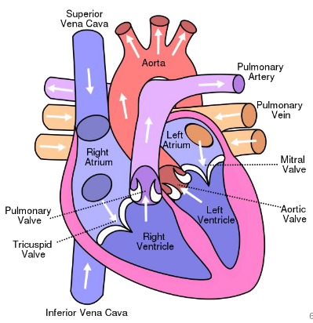

## Electric Potentials generated within the heart - The ECG Waveform

- Sinoatrial (SA) node
 - Bundle of nerves in right atrium
 - Function: start heart beat, assess rhythm
 - Pulses generated stimulate contraction of atrial muscles
- Atrioventricular (AV) node
 - Pulses from SA travel along conducting fibers in atrium
 - AV in lower part of heart wall between two atria on the septum
 - Acts as delay line
  - Provides appropriate timing between action of atria and ventricles
 - Stimulation vauses impulses to be sent to myocardium muscles of ventricles
  - Thus atria, ventricles functionally linked only by AV node and conduction
    system
 - Delay required so atrial contraction can complete ventricular filling before
   ventricular contraction
    - When ventricle depoolarising, atria repolarising
 - Depolarization, repolarization generate external bioelectric potentials
  - Can be recorded at surface of body

### ECG Waveform

- External representation of sequence of electrical activity of heart
- **Atrial Depolarisation** - P wave (0.25mV, 110ms)
- **Atrial Repolarisation** - TA wave (not always observed)
- **Ventricular Depolarisation** - QRS complex
 - **R-wave** - 1.6mV
 - **Q-wave** - 25% of R-Wave
- **Atriocentricular Conduction Time** - PR interval (120-220ms)
 - **QT Interval** - (350-440ms)
 - **ST segment** - (50-150ms)
- **Ventricular Repolarisation** - T-Wave (100-50ms)
- **U-Wave** may be after-potentials of ventricular muscle or repolarization of
  Purkinje fibres

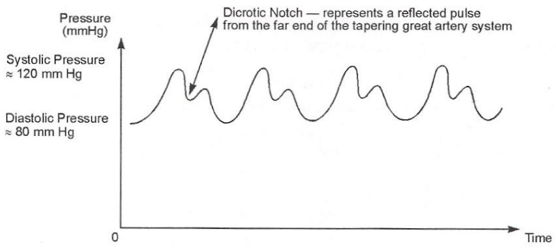

- Useful Terms:
 - **Brachycardia** - Abnormally slow heartbeat
 - **Tachycardia** - Abnormally fast heartbear
 - **Arrythmia** - Uneven spacing of heartbeats

## The Central Nervous System - The Neuron

- Neuron
 - Basic unit of nervous system
 - Single cell
 - Soma
  - Cell Body
 - Dendrites
  - One or more input fibres
 - Axon
  - Long transmitting fibre
  - Branches near end to Terminals
 - Axon Hillock
  - Part of Axon adjacent Soma
  - Point where Action Potentials generated

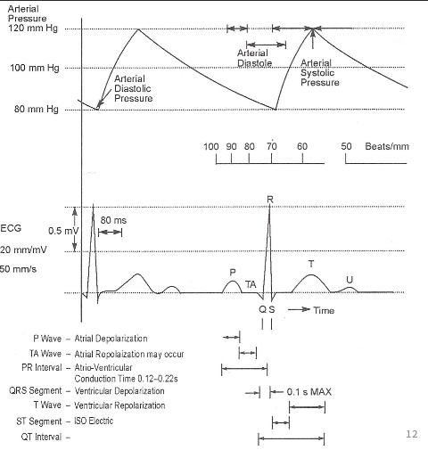

- Myelin
 - Fatty Insulating substance coating axons and dendrites of some neurons
 - Often interrupted at regular intervals by Nodes of Ranvier
 - Speeds up pulse transmission
- Neurilemma
 - Insulating layer surrounding myelin sheath outside central nervous system
 - Consists of thin cells, Schwann Cells
- When stimulus detected by dendrite, impulse generated in Soma, sent along Axon
- Neurons not directly connected
 - Impulses transmiit from one to the other via Synapses between axon terminals
   of one neuron and dendrites of a succeeding one
- Sensory Neurons
 - Transmit stimuli to central nervous system
- Motor Neurons
 - Transmit impulses to muscle tissue

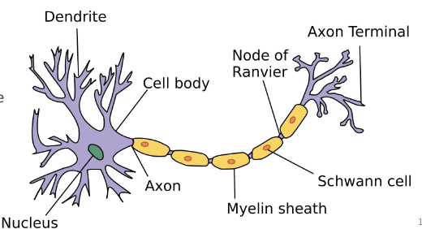

- Single axon can have multiple branches, making synaptic connections with many
  postsynaptic cells
- Single neuron can receive thousands of synaptic inputs from many presynaptic
  neurons

## The Nervous System - The Synapse

- Axon terminal of sending cell contains synaptic vesicles
 - Membrane-bound spheres filled with neurotransmitter molecules
- Synaptic Cleft
 - Small gap between axon terminal of presynaptic neuron and membrane of
   postsynaptic cell

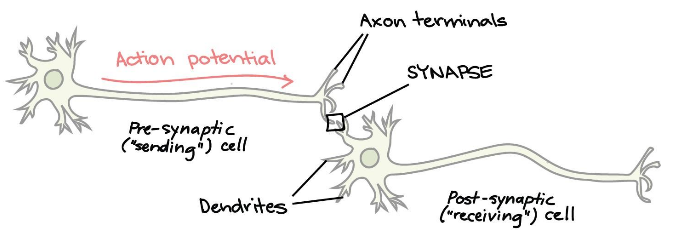

- Nerve impulse (action potential) arrives at axon terminal
 - Activates voltage-gated calcium channels in cell membrane
 - Ca^2+ in much higher concentration outside neuron than inside
  - Rushes into cell
 - Ca^2+ allows synaptic vesicles fuse with axon terminal membrane
  - Release neurotransmitter into synaptic cleft
 - Neurotransmitter diffuse across synaptic cleft
  - Bind to receptor proteins on postsynaptic cell
 - Activation of postsynaptic receptors lead to open/close ion channels in cell
   membrane
 - Depending on ions involved:
  - Depolarizing (excitatory)
  - Hyperpolarizing (inhibitory)
- Postsynaptic neurons add together/integrates all inputs received
 - Triggers action potential at axon hillock if summation above threshold
- Spatial Summation
 - Integration of postsynaptic potentials from different dendrites that occur
   about the same time
- Temporal Summation
 - Integration of postsynaptic potentials occur at same place, at slightly
   different times
  - E.g: presynaptic neuron fires quickly multiple times, driving membrane
    potential above threshold

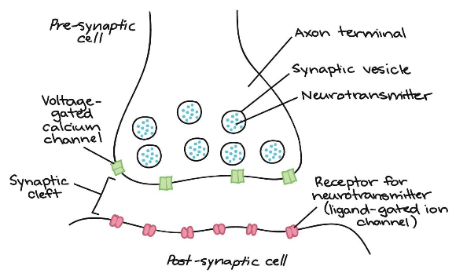

- Must be some way to "turn off" signal once sent (clear synaptic cleft of
  neurotransmitter for synapse to function effectively
- Let postsynaptic cell return to normal resting potential, ready for new
  signals
- Neurotransmitter may
 - Diffuse away
 - Broken down by enzyme
 - Sucked bacak into presynaptic neuron
 - 'Mopped up' by nearby glial cells
- Anything (drugs, incesticides, toxins) interfere with proces that terminate
  synaptic signal can have significant physiological effects
- Action potential all-or-none response
- Synaptic signalling more flexible
 - Changes can strengthen/weaken communication at particular synapse
  - Sending neuron can "dial-up"/"dial-down" amount of neurotransmitter released
    in reponse to arrival of action potential
  - Receiveving cell can alter
   - Number of receptors it puts on its membrane
   - How readily it reponds to activation of receptors
- Plasticity makes synapse key site for altering neural circuit strength
 - Plays role in learning, memory, addiction
- Different presynaptic, postsynaptic cells produce different neurotransmitters
  and neurotransmitter receptors
 - Different interactions, effects on postsynaptic cell

## The Nervous System - The Electrical Synapse

- Electrical Synapses
 - Direct physical connection between pre/postsynaptic neuron in form of channel
   called gap junction
   - Allows current (ions) flow directly from one cell to another
 - Transmit signals more rapidly than chemical
 - Allow for synchronized activity of group of cells
 - Carry current in both directions
  - Depolarization of posstsynaptic neuron can lead to depolarization of
    presynaptic neuron
 - Cannot turn excitatory signal in one neuron into inhibitory signal in another
   (unlike chemical synapse)
 - Lack versatility, flexibility and capacity for signal modulation seen in
   chemical synapses

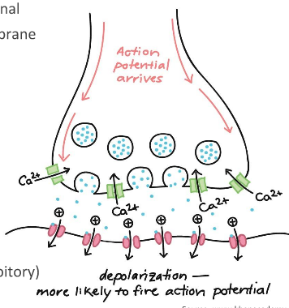

## The Nervous System - Operation and Function

- Operation fundamentally based on
 - Action potentials/impulses in neurons
 - Synapses of one neuron to another
 - Summation of neural inputs in dendrite tree of neuron
 - How neural inputs affect generation or not of its own action potential
- Main function of nervous system
 - Control of bodily activity, configuration through sensing and motor signals
   flowing on neurons
- Some of the acivities
 - Available to concious control
 - Subconcious, auto controlled - e.g. heart rate, digestion
 - Unconcious, relflexive
- Spinal cord responsible for reflexive actions becauseee response can be much
  faster than if stimuli had to travel to brain for processing

## The Nervous System - Structure and Function

- More complex responses require more sophisticated processing capabilities of
  brain, consists of three main parts
 1. Cerebrun (including cerebral cortex)
  - Large amouts of info can be stored, analysed, used for immediate/future
    reference
  - Approx. 9 of 12 billion neurons in brain
  - Responsible for
   - Sensing activities; seeing, hearing, touching
   - Memory of past events and sensations
   - Conciousness, Awareness, Thinking processes
   - 2 Hemispheres joined by corpus callosum, each divided into four lobes
    - Frontal:
     - Emotion, personality, consciousness, awareness, thinking processes
    - Parietal:
     - Part of cortex responsible for sensing, motor actions
    - Occipital:
     - Vision
    - Temporal:
     - Part of cortex responsible for hearing, storage of long-term memories of
       past events and sensations

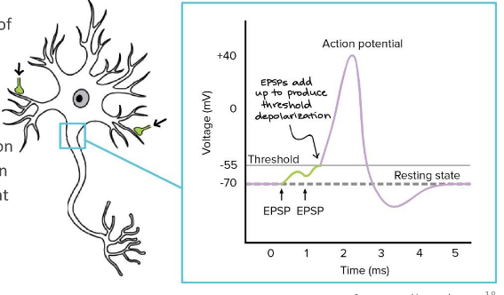

 2. Cerebellum (major feature of hindbrain of vertebrates
  - Responsible for:
   - Balance
   - Low-level motor control processes in operation of muscles
   - Loearning to adjust to changes in sensorimotor relationships
  - May be involved in cognitive functions such as
   - Attention
   - Language
   - Regulating fear/pleasure responses
 3. Medulle (in brainstem, connects higher levels of brain to spinal cord)
  - Responsible for:
   - Autonomic (involuntary) functions ranging from:
    - Vomiting to sneezing
    - Basic functions:
     - Breathing, heart rate, kidney functions, blood pressure
  - May contain timing mechanisms as part of these processes

## The Nervous System - Electroencephalogram (EEG)

- Recording of gross electrical activity of brain, taken frm electrodes placed
  at strategic points aroud head
- Result of biopotentials in brain
- Not possible to isolate/distinguish firing of individual neurons except by
  invasive procedures
- Varies in form amplitude, frequency
- Generally consists of rhythmically slow, sinusoidal-like waveforms
  10-100microN in amplitude
- Basic frequency of aroud 10Hz markedly reduces in amplitude with increase in
  mental activity called alpha rhythm

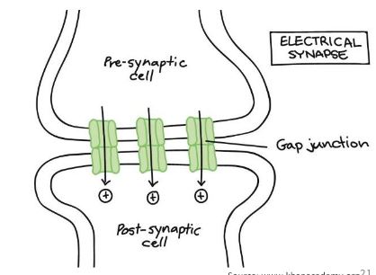

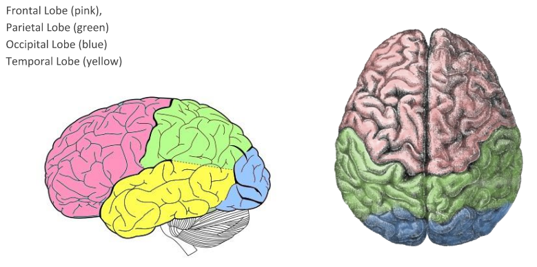

## The Nervous System - Muscle action and the electromyogram EMG

- Motor Unit
 - Biological unit of muscle function
 - Consists of motor nerve arising from motor neurons in brainstem/spinal cord,
   branching into various motor end plates
- Motor End Plates
 - Connected to individual muscle fibres
 - Stimulation causes contraction of single muscle fibre attached to it
- Generally larger muscle, more motor units found
 - Size of motor unit (no. of fibres activated by same nerve fibre) may vary in
 human from 25 to 2000 muscle fibres
- Muscle fibres not clumped together in one part of muscle
 - Fibres of different units interlaced

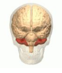

- Individual neuron can only exist in polarised/depolarised state:
 - Only transmits one/other of these potential levels to motor end plates
 - Causing binary on/off action of muscle fibres
 - Individual muscle fibres of one motor unit can only exist as relaxed/tensed
 - Normal muscle activity (in terms of movement, steadiness, precision)
  - due to combined effect of large no. of motor units comprising any one muscle
 - More motor units recruited into action as greater effort required of muscle
 - Additional smoothness movement obtained by modulating no. muscle fibre
   contractions per unit time (similar to pulse width modulation)
 - Muscular effort controlled by no. of motor units activateed, rate of
   activation
- Skeletal Muscles
 - Generally considered under control of the brain
 - Reflex action
  - Control loop through brain short-circuited by local loop through spinal
    cord
  - Oftern response to large sensory neuron signal - high repitition impulse
    rate
- Bioelectric potentials associated with muscle activity measured in EMG
 - Measured at surface of body, near muscle of interest, directly from muscle by
   penetrating skin with needle electrodes
 - Most measurements intended to obtain indication of amount of activity of a
   given muscle/group of muscles rather than individual muscle fibre
 - Pattern usually summation of individual action potentials from fibre
   constituting muscles being measured
 - Amplitude of measured EMG waveform instantaneous sum of all action potentials
   generated at given time
  - Action potentials sometimes add, sometimes cancel
 - EMG waveform appears like random noise waveform with energy of signal being
   function of amount of muscle activity and electrode placement
