# Electrocardiograph

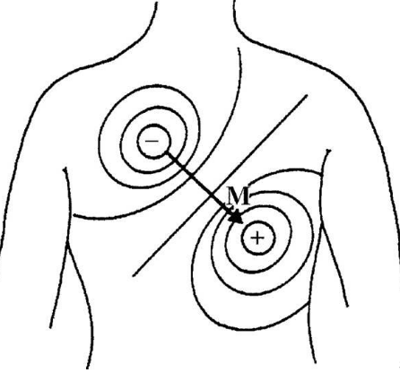

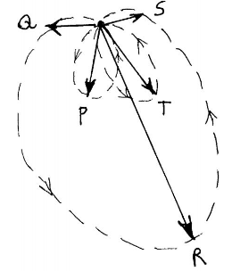

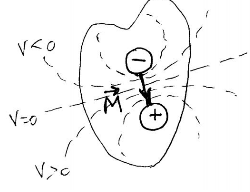

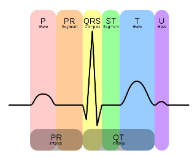

.
.
.

- Pairs of electrodes at different locations give different V at same t because
  of spatial structure of cardiac electric field
- ECG Leads - differential electrode config across the body
 - Each picks up different projections of cardiac vector time waveform
 - Pair of electrodes form a lead
- Lead Vector for pair of electrode locations
 - Unit vector defines direction a const magnitude cardiac vector must have to
   generate maximal V in pair of electrodes positioned at given location
- Important to have standard positions, e.g. limbs, for clinical eval of ECG

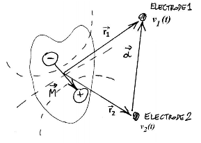

- Lead vector a
 - unit vector in direction $r_1 - r_2$
- Lead Voltage
 - $v_a(t) = v_1(t) - v_2(t)$
 - Differential V between end points of lead vector
 - $v_a(t) = M(t).a$

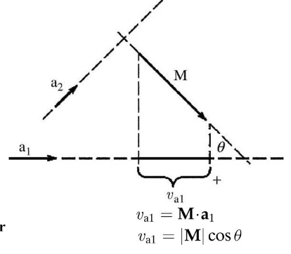

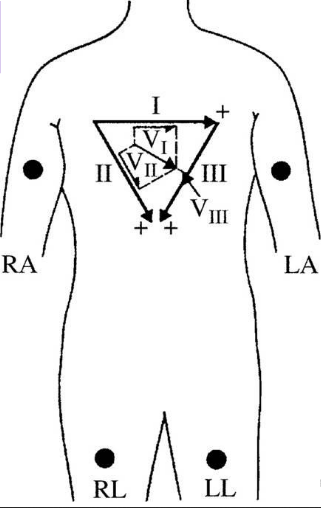

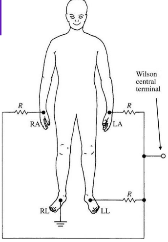

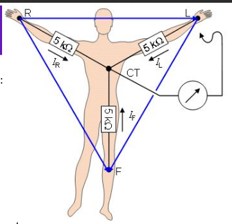

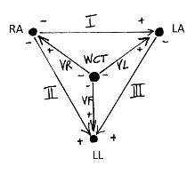

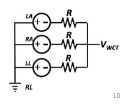

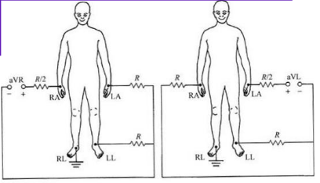

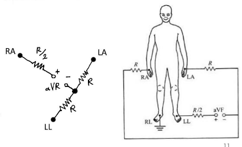

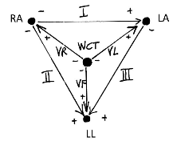

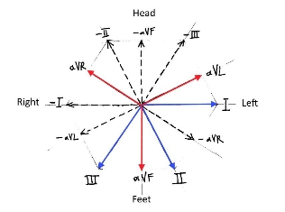

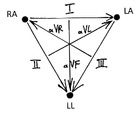

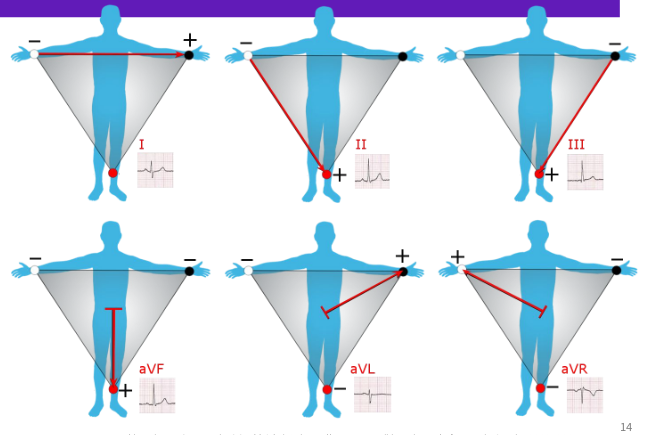

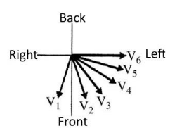

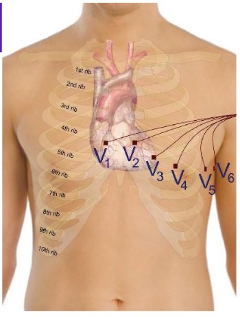

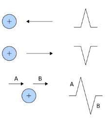

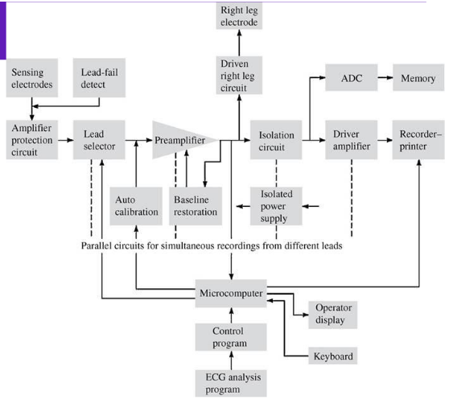
