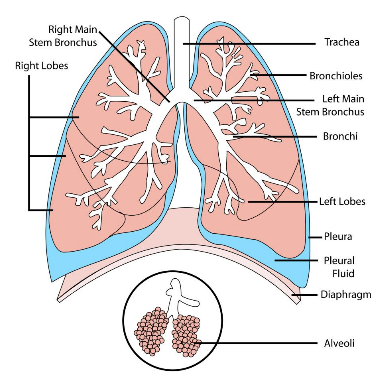
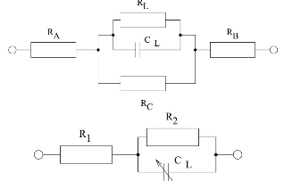
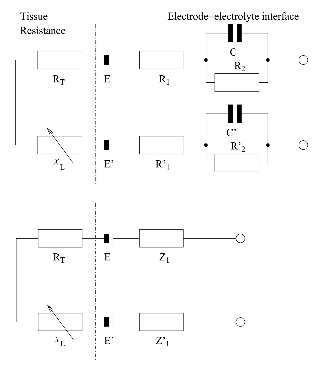
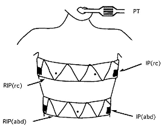
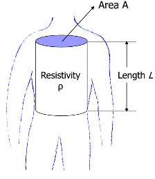
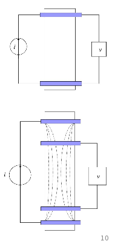
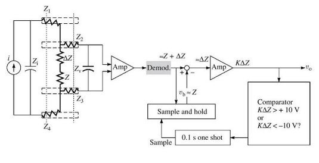
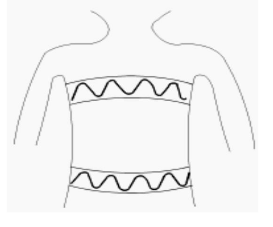
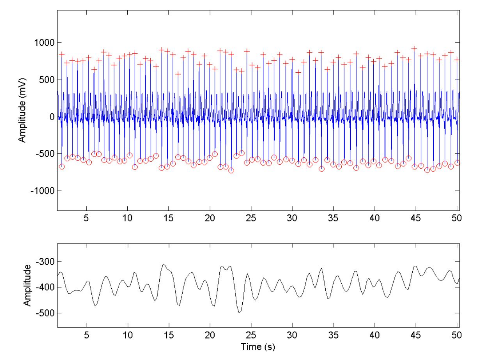

# Respiration

## The Respiratory System

- Respiration
 - Chemical provess of releasing energy from organic compouds.
 - Can be either aerobic (uses O2) and anaerobic (no O2)
 - Often used as synonym for breathing
- Gas exchange
 - Movement of O2 into organism and CO2 out of an organism
- Breathing
 - ventilation moovements needed in some larger animals so efficient gas
   exchange can take place
 - Involves airways, ribs, intercostal muscles, diaphragm and lungs
  - Known as respiratory system
- In mammals, gases exchanged between red blood cells and air in alveoli
- Alveoli are tiny sacks with very thin walls ensuring that the nnumerous
  cappilaries that surroud them are very
-
-

## Measuring Respiration

- Plays a central role in peripheral autonomic system
- Rhythm of breathing can be found in fluctuations of blood pressure, vascular
  resistance, pupil diameter, and short term HR variability'
- Accesing respiratory activity may help in investigating changes foud in other
  physioogical subsystem of the body
- Respiratory rhythm in particular is vital parameter used to detect
  paathological changes of breathing
- Wish to measure two aspects of respiration: freq of breaths and their depth
- Unlike heart, lungs fo not generate electrical signals which can be easily
  detected
- chest movement aside, two obvious physical effects correlated

-
-

## Measuring Respiration - Impedance plethusmography

- Lungs consist of large number of sacks of air surrounded by capillaries
 - Surrouding capillaries and tissue can be consifered to be conductive with low
   R
 - Air can be trated as insulator at DC
 - Lungs can be considered to have an inherent capacitance dependent on the
   volume of air contained in the
- Model of impedance at given point in time between two pointsss of te upper
  body as shown in right, where Ra, Rb, and Rc model resistanec of general body
  tissue while Rl and Cl model impedance of lungs
-
-
-

- By coimbining simplified electrical model of chest with electroe model frm
  before, overall equivalent circuit fr the tissue, includeing the lungs and
  air, and the electrofe sustems can be determined
- Here, determining Xl (the reactance resulting frm the air in the lungs) will
  lower
-
-

- Blood flow
 - As suspension
-
-

- Need two pairs of electroes
 - Need to take measurements at differene freq to characterise differenc
   reactance in the circuit
 - Different freq means that
  - cant directly combine results as phasors
  - Need to measure magnitude and phase of impedance in each case
  - need to used independent
-
-

- Summary
 - Breathing results in changes of air volume in the lungs which alters the
   electrical capacitance of the lungs
 - By measuring capacitance we can infer the volme of air in the lungs
 - If we

 

## Measuring Respiration - Impedance Plethysnography

- If we model thorax as a cylinder, electrical impedance Z is given by: $$
-

- Simplest method - Two-Electrode System:
 - same electrodes for current injection and voltage measurement
- Basis of earlier analysis

- Current source injects i into two outer electrodes causing a constant i to
  flow through thorax, resultant V sensed across two inner electrodes
- Amplification and demodulation yield $$, change in electrical impedance due to
  breathing
-

- Alternative approach - Inductance plethysmography
- USes pair of wire loops, each attached in zig-zag pattern to highly compliant
  belt, one around ribcage, one around abdomen
- One wire loop excited by low-level radio frequency signal
- Changes
-

## Measuring Respiration - ECG-derived respiration (EDR)

- Indirect effects on cardiovascular system can be used to reconstruct
  respiratory signals
- Respiration has been successfully extracted from ECG, BP and
  photoplethysmograms
- EDR signal is consequence of direct influece of breathing on ECG morphology
  and variation of heart rate
- Mechanisms that affect morphology of QRS-complexes include:
- Morphological alterations caused by thorax movements and change of ECG
   electrode distances
 - Apex of heart changes position during inspiration and expiration
 - Variation of QRS area, R-peak amplitude, RS distance and RS slope directly
   proportional to respiratory movement
- In addition to ECG morphology, dynamic changes of RR intervals can be used to
   estimate EDR signal
- No additional HW needed for deriving respiration from ECG
- Diagram shows long-sequence ECG waveform (top) with peaks and troughs
  indicated by '+' and 'o' respectively
- Lower waveform is measured respiration waveform. Our task is to derive second
  from first by signal-processing the ECG data
- Two basic assumptions are that ECG is affected by respiration waveform by
  either/both of:
 - Amplitude modulation (QRS height or area changes due to observational axis of
   the cardiac vector changing
 - Frequency modulation (respiratory Sinus Arrythmia of the ECG die to
   parasympathetic modulation ...
- Traces show ECG lead, the variation over time of the HR and the cycles of
  inhalation and echalation of respiration
- ECG amplitude changes with respiration are not obvious here
- HR
- Central Moment
 - Effect of respiration on complex manifsted in variation of RS slope. Authors
   detectes slopes using 4th order central moments, a statistical masure defined
   by: $$
- Vector $$ is a segment of the ECG signal with length L and mean value $$
- 4th order central moments calculated in a sliding window of $$ with a step
  width of $$ sample
- Maximum of 4th order central moments of each R wave used to quantify RS slope
- Maximum central moment of each RS distance was extracted and cubic spline
  interpolated, and the EDR signal finally bandpass filtered
- In traces in diagram:
 - ECG signal from LEad II
 - 4th order central moments estimated on RS distances (blue) with detected
   maxima (red) and their cubic interpolation (green)
 - Resulting EDR signal (green) and rederence respiration signal (blue)
- RS slope
 - Another approavh to evaluating
- RS distance
 -
- RS
 -
-

- Respiratory Sinus Arrythmia

## Measuring Respiration - Tools for Quantifying Comparisons of EDR Results

- Respiratory rate of reference $$ and the EDR signal $$ were compared using
  mean absulute error $$ and relative absolute error $$
 - $$
 - $$
- For EDR rates linear dependence on the reference rate, calculated Pearson
  correlation coefficient $$,(a measure of linear correlation between two
  varaiables X and Y), i.e. the quotient of covariance of X annd Y $$ and the
  standard deviation of X and Y $$ with $$, $$, and $N$ samples.
 - $$
- The concordance coeffiient
-
-

- This bias can be subdivided
-
-
- A one sample t-Test disclosed no significant over/under estimation of BR using
  any of the approaches
- No linear dependency of errors of any method on actual respiration rate
- All considered approaches performed comparably well in reconstruccting
  breathing rates with no statistical evidence of one superior method
- Because $$ revealed lowest mean absolute error and maximised both correlation
  and concordance coefficients, they used this for subsequent study

